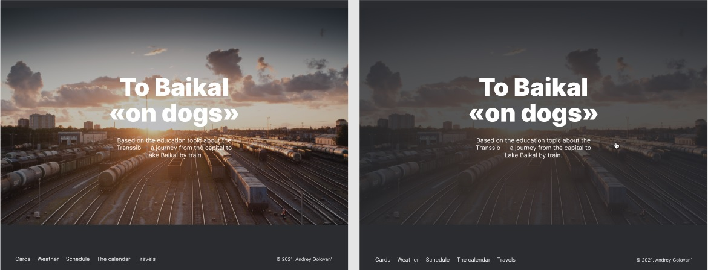

# Travel to Russia
Final project work of the 2nd year of the faculty ["Web developer"](https://practicum.yandex.ru/web/?utm_source=yandex&utm_medium=cpc&utm_campaign=Yan_Sch_RF_Webr_Razrab_Des_Intro_460&utm_content=sty_search:s_none:cid_56600998:gid_4359516496:pid_23387311960:aid_9838725511:crid_0:rid_:p_1:pty_premium:mty_syn:mkw_:dty_desktop:cgcid_0:rn_Москва:rid_213&utm_term=разработка%20web&yclid=4769457341696616776) of the educational platform [Yandex.Praktikum](https://practicum.yandex.ru/).

*Выбрать язык:* [RU](https://github.com/andrey-71/russian-travel/blob/main/README.md)


## Project description:
A one-page website dedicated to traveling in Russia.

**[Project on GitHub Pages](https://andrey-71.github.io/russian-travel/index.html)**


## Functional:
* Responsive design on screen width resolutions from `320px`;
* Multilingualism-switching between Russian and English;
* All links are working, lead to external resources;
* Links and interactive elements have the hover state: `hover`

Example of the hover effect in the `cover` section:




## Technologies:

### 1. HTML
* Markup by [layout](https://www.figma.com/file/5S2WSbEFL6awjVWJ0NWL8Q/Sprint-3_-Russia-_-desktop-%2B-mobile?node-id=28503%3A0) Figma;
* Semantic markup;
* Optimization of images `.jpg`, `.png`, `svg`-graphics.

### 2. CSS
* BEM, Nested BEM;
* Flexbox;
* GridLayout;
* Media queries;
* normalize.css is used to reset browser styles;


## Installation instructions:
* Clone the repository:

    ```
    git clone https://github.com/andrey-71/russian-travel.git
    ```


## Project requirements:
* [Checklist](https://code.s3.yandex.net/web-developer/checklists/new-program/checklist-3/index.html)


