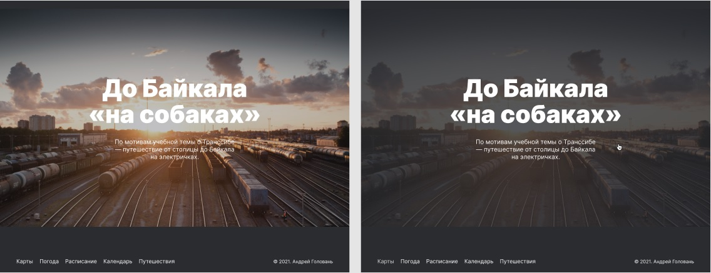

# Путешествие по России
Итоговая проектная работа 2 курса факультета ["Веб-разработчик"](https://practicum.yandex.ru/web/?utm_source=yandex&utm_medium=cpc&utm_campaign=Yan_Sch_RF_Webr_Razrab_Des_Intro_460&utm_content=sty_search:s_none:cid_56600998:gid_4359516496:pid_23387311960:aid_9838725511:crid_0:rid_:p_1:pty_premium:mty_syn:mkw_:dty_desktop:cgcid_0:rn_Москва:rid_213&utm_term=разработка%20web&yclid=4769457341696616776) образовательной платформы [Яндекс.Практикум](https://practicum.yandex.ru/).

*Select a languages:* [EN](https://github.com/andrey-71/russian-travel/blob/main/README.en.md)


## Описание проекта:
Одностраничный сайт, посвященный путешествиям по России.

**[Проект на GitHub Pages](https://andrey-71.github.io/russian-travel/index.html)**


## Функционал:
* Адаптивный дизайн на разрешениях ширины экрана от `320px`;
* Мультиязычность - переключение между русским и английским языком;
* Все ссылки рабочие, ведут на внешние ресурсы;
* Ссылки и интерактивные элементы имеют состояние наведения `:hover`

  Пример эффекта наведения в секции `cover`:

  


## Технологии:

### 1. HTML
* Верстка по [макету](https://www.figma.com/file/5S2WSbEFL6awjVWJ0NWL8Q/Sprint-3_-Russia-_-desktop-%2B-mobile?node-id=28503%3A0) Figma;
* Семантическая верстка;
* Оптимизация изображений `.jpg`, `.png`, `svg`-графики.

### 2. CSS
* БЭМ, Nested БЭМ;
* Flexbox;
* GridLayout;
* Media queries;
* Применяется normalize.css для обнуления стилей браузера;


## Инструкция по установке:
* Клонировать репозиторий:

    ```
    git clone https://github.com/andrey-71/russian-travel.git
    ```


## Требования к проекту:
* [Чеклист](https://code.s3.yandex.net/web-developer/checklists/new-program/checklist-3/index.html)


